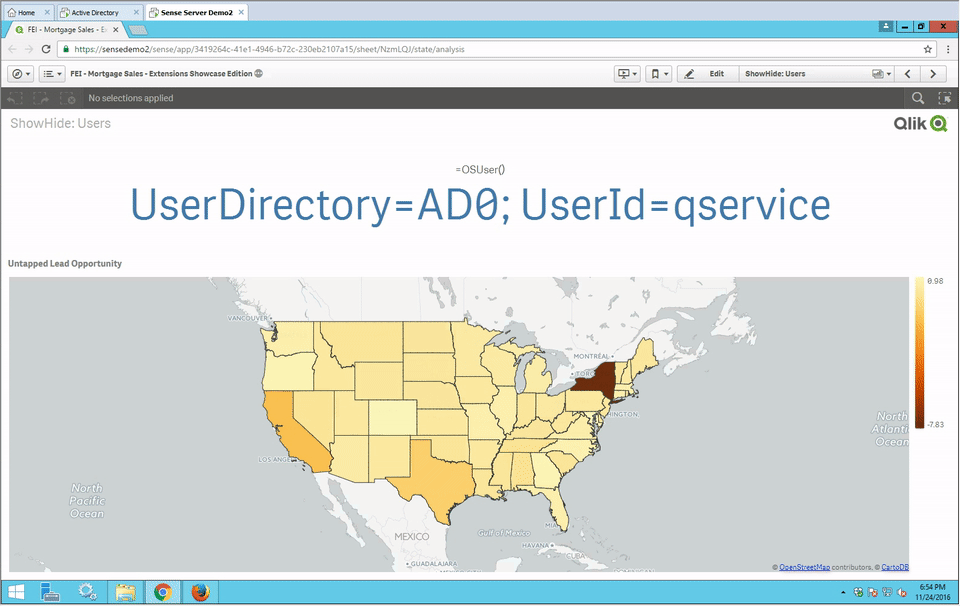
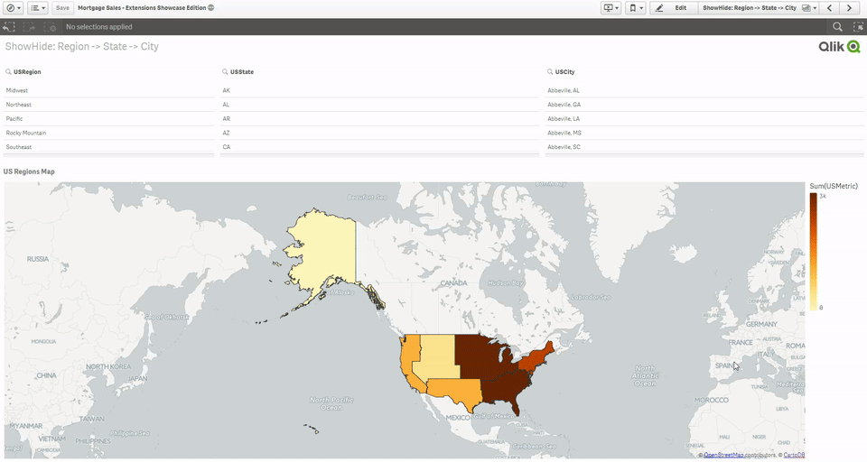
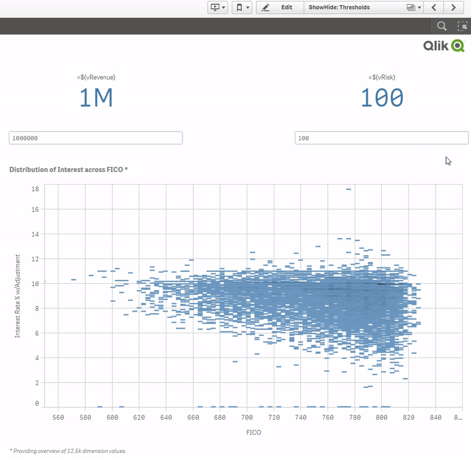
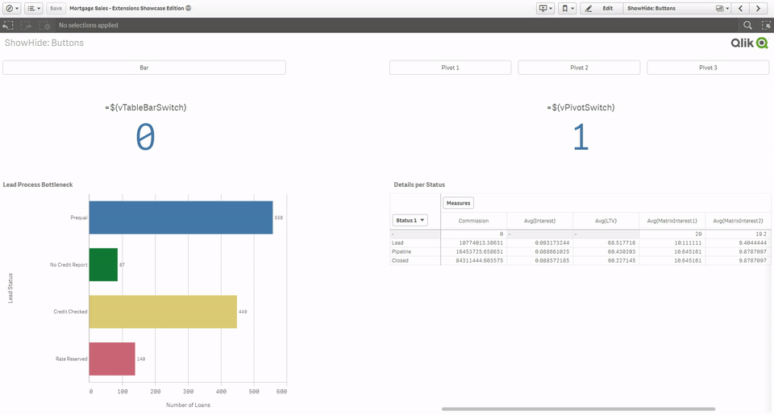
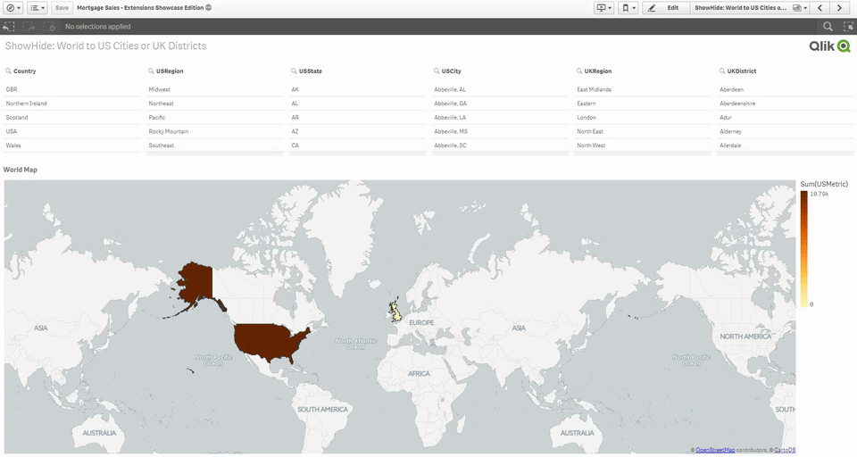

# ShowHide
A container that shows or hides master visualizations based on IF conditions. This extension is a part of Qlik dashboard bundle, first delivered with Qlik Sense November 2018.

These IF conditions that control which visualization are shown could be based on:
 - User accessing the chart
 - Variables for real estate
 - Variables for alerting
 - Drilldown Maps (GetPossibleCount)
 - Drilldown into Big Data (GetPossibleCount)

# Get Started

## Installation
1. Download the extension zip, `qlik-show-hide-container.zip`, from the latest release (https://github.com/qlik-oss/ShowHide/releases/latest)
2. Install the extension:

    a. **Qlik Sense Desktop**: unzip to a directory under [My Documents]/Qlik/Sense/Extensions.
    
    b. **Qlik Sense Server**: import the zip file in the QMC.

## Examples:
### User accessing the chart: 
The container shows executives a map of their territories, but shows analysts a more local chart such as a bar chart of their accounts, since a map of their location would not be useful to them.
Example: =IF(Right(OSUser(),8)='qservice',1,0)


### Drilldown Maps (GetPossibleCount): 
Useful for drilling down into different layers of maps, such as US Regions -> US States -> US Cities. Based on the current possible values of a field, show the most relevant map. If the current selections result in one possible US State, show a point map of all the cities within this state.


### Thresholds for alerting: 
Different visualizations are shown based on the result of a KPI or variable. This allows you to see the most current, relevant, or urgent chart on your dashboard. If revenue is currently too low, you see a chart to address revenue. If risk is too high, you see another chart that addresses risk. This is particularly useful on a first-page dashboard to dynamically build your overview based on the current status of your business.
Example: =IF($(vRisk)>100,1,0)


### Variables for real estate:  
Buttons control a variable's value. Different visualizations are shown or hidden based on the variable's value.  This allows you complete control over your charts' details, as opposed to having IF conditionals inside the dimensions/measures. Since you can edit each master visualization individually, you have control over the number of dimensions/measures, null/zero data handling, data granularity, column structure in pivot charts, conditional coloring, etc.
Example: =IF($(vChartsSelector)=3,1,0)


### Drilldown into Big Data (GetPossibleCount): 
Incredibly useful for drilling down into Big Data, showing the big picture and drilling down into the smaller picture etc. Drilling from a pie chart of revenue streams, to a line chart of departments' performance over time, to a bar chart of sales reps in a struggling department, to a rep's accounts, etc.

This can also be used to drill down from a world map into different paths for each country. From the world map, if the UK is selected, drill down to the UK's regions, then UK districts etc. If however the US is selected from the world map, drill down to the US's regions, states, then cities, then if one city is selected, show the sales reps in this city.
Example: IF(Country='USA' and GetPossibleCount("USRegion") = 1 and GetPossibleCount("USState") <> 1 and GetPossibleCount(USCity) <> 1,1,0)


### How It Works:
If the IF conditional of a chart results in 1, it is shown. If it is 0, it is hidden. If there are more than one visualization condition resulting in 1, or all conditions result in 0, then a default visualization is shown.

# Developing the extension

If you want to do code changes to the extension follow these simple steps to get going.

1. Get Qlik Sense Desktop
1. Create a new app and add qsVariable to a sheet.
2. Clone the repository
3. Run `npm install`
4. Change the path to `/dist` folder in `gulpfile.js(row 8)` to be your local extensions folder. It will be something like `C:/Users/<user>/Documents/Qlik/Sense/Extensions/qlik-show-hide-container`.
5. Run `npm run build:debug` - this command should output unminified code to the path configured in step four.

```
// Minified output to /dist folder.
$ npm run build
```

```
// Outputs a .zip file to /dist folder.
$ npm run build:zip
```

# Original Author
[fadyheiba](https://github.com/fadyheiba)
